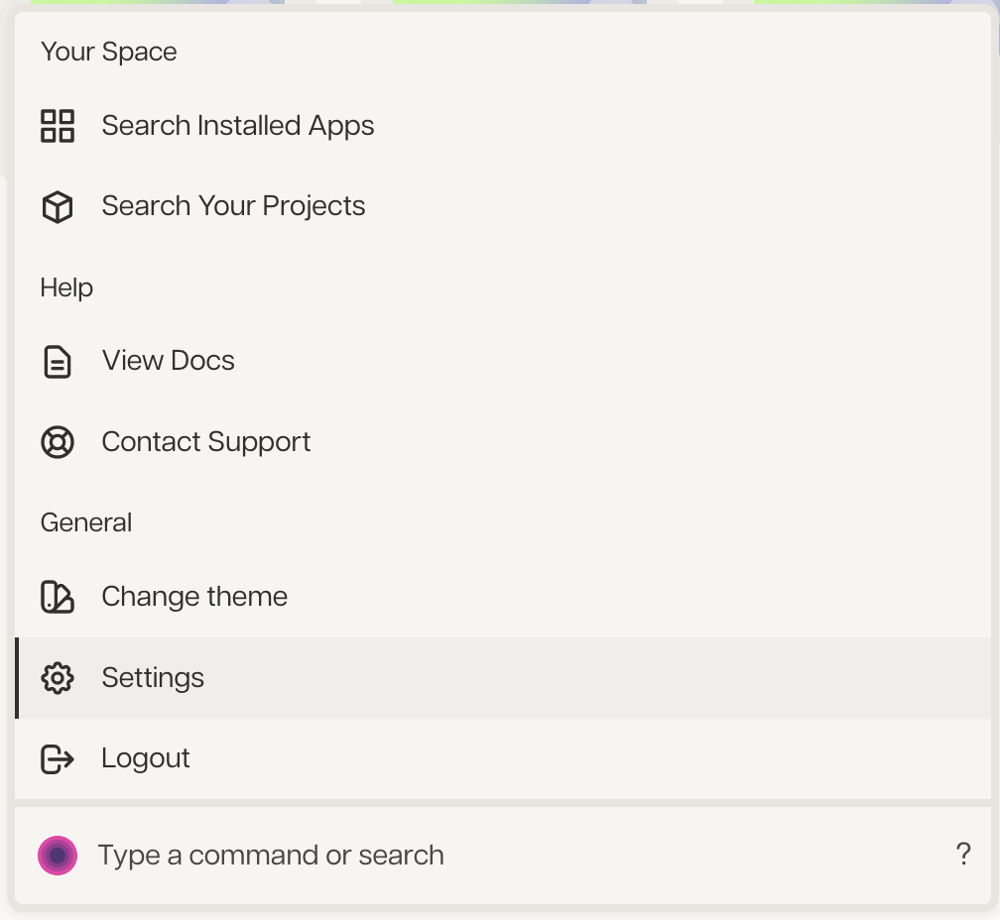

# Express+Svelte+Deta Starter

This repo is a starter kit using Express and Svelte for Deta.

## Installation

```bash
git clone git@github.com:shinokada/express-svelte-deta.git my-app
cd my-app/frontend
pnpm i
cd ../backend
pnpm i
```

## Branches

### main

Express+Svelte+Deta

```bash
git checkout main
pnpm i
```

### tailwind

Express+SVelte+Deta+TailwindCSS

```bash
git checkout tailwind
pnpm i
```

Or clone the branch:

```bash
git clone --branch tailwind git@github.com:shinokada/express-svelte-deta.git my-app
```

### flowbite-svelte

Express+SVelte+Deta+TailwindCSS+Flowbite-Svelte

```bash
git checkout flowbite-svelte
pnpm i
```

Or clone the branch:

```bash
git clone --branch flowbite-svelte git@github.com:shinokada/express-svelte-deta.git my-app
```

### svelte-spa-router

Express+SVelte+Deta+Svelte-Spa-Router

```bash
git checkout svelte-spa-router
pnpm i
```

Or clone the branch:

```bash
git clone --branch svelte-spa-router git@github.com:shinokada/express-svelte-deta.git my-app
```

### svelte-spa-router-flowbite

Express+SVelte+Deta+Flowbite-Svelte+Svelte-Spa-Router

```bash
git checkout flowbite-svelte-spa-router
pnpm i
```

Or clone the branch:

```bash
git clone --branch flowbite-svelte-spa-router git@github.com:shinokada/express-svelte-deta.git my-app
```

## Deta.space

### Install CLI:

```bash
curl -fsSL https://get.deta.dev/space-cli.sh | sh
```

### Login

```bash
space login
```

This command will ask for an ‘access token’ to authenticate your CLI.

```bash
? Enter access token >
```

To get an access token, enter your Space dashboard, open the Teletype (command bar) and click ‘Settings’:



Click ‘Generate Token’ to generate an access token and copy the resulting token and paste this back into your CLI prompt.

```bash
👍 Login Successful!
```

### Create a project

```bash
space new
```

### Deploy

```bash
space push
```

### Release

```bash
space release
```

## env

Add production preset to Sapcefile

```
...
      presets:
        env:
          - name: SECRET_MESSAGE
            description: Secret message only available to this Micro
          - name: REDIS_URL
          - name: NODE_ENV
          - name: API_URL
```

Then add env value on `https://deta.space/builder/your-app-code/develop?tab=config`.

## Express/index.js

```js
import cors from 'cors';
import dotenv from 'dotenv';
dotenv.config()
import express from 'express';
const app = express();
const port = process.env.PORT || 3000;
let apiUrl = process.env.API_URL || '/api';

const router = express.Router();

app.use(cors());
app.use(apiUrl, router);
app.use((req, res, next) => {
  res.setHeader('Content-Type', 'application/json');
  next();
});

router.get('/', (req, res) => {
  res.json({ message: 'From Express API', node_env: process.env.NODE_ENV });
});

app.listen(port, () => {
  console.log(`Server running at http://localhost:${port}`);
});
```

### cors

```js
import cors from 'cors';
app.use(cors());
```

Start a server:

```bash
cd backend
npm run dev
```

Go http://localhost:3000/api

## Svelte

Start Svelte:

```bash
npm run dev
```

Go to http://127.0.0.1:5173/


